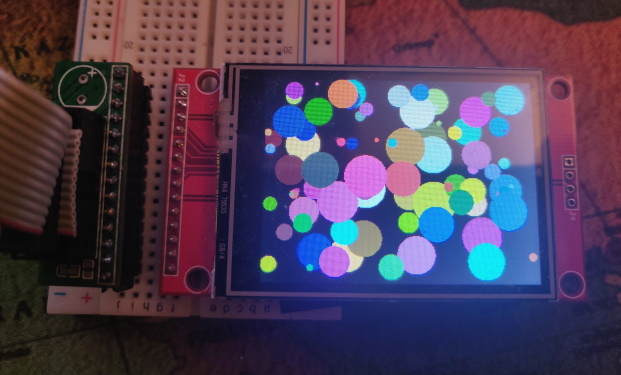

# ILI9341_T4

## Optimized ILI9341 screen driver library for Teensy 4/4.1, with vsync and diff. updates.

This library implements a SPI driver for the ILI9341 screen providing the ability to display memory framebuffers onto the screen very efficiently. 
In particular, the following advanced features are available:

- **'diff' redraw.** The driver compares the framebuffer to be uploaded with the previous one (mirroring the current screen content) and uploads mainly the pixels that differ. It does so in a smart way to minimize spi transaction / RAWRW commands. Uploading only part of the screen makes it possible to achieve extremely high frame rates when moderate changes occur between frames (hundreds of FPS for simple cases like UIs). 

- **async. updates via DMA.** Upload can be performed directly or done asynchronously using DMA (even in the case of complicated diff updates) which means that the MCU is free to do other tasks (like generating the next frame) during updates. DMA SPI transfer can be clocked at over 50Mhz and can use the bus at its full capacity when needed. 

- **adjustable framerate.** The screen refresh rate can be adjusted and a framerate can be set within the driver. Uploads are then timed to meet the requested framerate. 

- **vsync and screen tearing prevention.** This is the best part :-) The driver monitors the position of the current scanline being refreshed on the screen and orders the pixel updates so that they trail behind this scanline. This makes it possible to completely suppress screen tearing when the update can be done in less than two refresh periods ! In most cases, this makes it possible to reach 50FPS without any screen tearing using only moderate spi speed !

- **Multiple buffering methods.** Support direct upload, double buffering and triple buffering configurations.  

- **driver for XPT2046 touchscreen.** Some ILI9341 screens have an associated touchscreen. The driver can manage this touchscreen on the same spi bus making sure there is no conflict.  This simplifies the wiring since only two additional wires are needed to enable touch in that case.  

## Remarks

(1) This library only performs framebuffer upload from memory to the screen but does not provide any drawing primitive. You must use another canvas library to draw directly on the memory framebuffer. 

(2) This library only works with Teensy 4/4.1 but not with Teensy 3.2/3.5/3.6. You need lots of memory to use the driver (2 framebuffer plus diff buffers) so it would not be practical to use with those other MCUs anyway...

## Using the library

TODO... 

See the examples and look into the header file [ILI9341Driver.h](https://github.com/vindar/ILI9341_T4/blob/main/src/ILI9341Driver.h): each public method has a detailed docstring explaining its purpose and the meaning of the input parameters. 

## Credits

- This library was inspired by [Kurte's ILI93451_t3n library](https://github.com/KurtE/ILI9341_t3n) which is where I learned all the 'fun' stuffs about DMA and SPI low level configuration... 

- The code for driving the touchscreen is borrowed from [Paul Stoffregen's XPT2046 touch screen library](https://github.com/PaulStoffregen/XPT2046_Touchscreen). 

